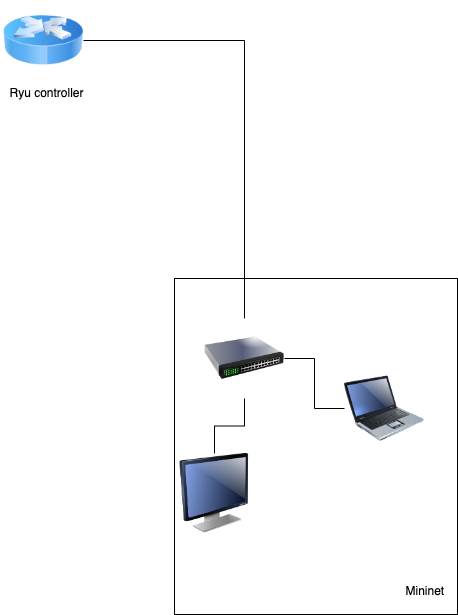

# 2023年CS305计算机网络期末项目

## 项目简介
在南科大，你一定遇到过各式各样的网络问题，比如说丢包，延迟过大或者不能自动连接WiFi。这些常见的问题实际上很多都需要和我们的信息中心打交道，我们的信息中心的核心路由类似一个拥有很多功能的网关，它可以提供很多基本服务，例如DNS服务器，DHCP。在本次项目中，我们将自己动手设计一个简化版的南科大核心路由，我们希望大家可以在编写的过程中学习到更加深入的计算机网络知识。
### Mininet
Mininet 是一个用于创建虚拟网络的工具，它可以在单一的计算机上模拟出一个包括多个主机、交换机、路由器在内的网络拓扑，并可以使用实际的协议栈进行测试，从而避免了在真实网络中进行实验可能带来的风险。
Mininet[官网](http://mininet.org/)。

本次项目中，我们通过Mininet进行简单网络模拟，从而实现网络中的各种功能，达到学习网络结构的目的。

### Ryu
Ryu 是一个用 Python 编写的软件定义网络 (SDN) 控制器，它的主要作用是管理和控制网络中的交换机和路由器，提供灵活的网络编程和控制服务。通过使用 Ryu，我们可以编写脚本实现自定义的流量控制和遥测服务，实现网络中各种功能，包括流量控制、攻击防御、质量保证、路径分配等等。
Ryu的[官方资源](https://ryu-sdn.org/resources.html)。

在本次项目设计中，你的主要任务就是设计这个控制器，其需要完成我们的
### 整体架构设计
整体样例代码设计如下
```text
- network
    - topo            拓扑架构
        - topo.py     架构文件
    - command_tool.py Mininet工具
    - run_mininet.py  Mininet运行脚本
- controller.py       你的Ryu控制器
```
我们设计的框架思路是一个Ryu控制器操控整个Mininet架构，如下图所示

## 环境配置
我们提醒任何人都应该将本节**一字不落**的读清楚，如果你的基础环境配置遇到问题，请务必按照这个说明重新配置。
### Windows和其他amd64结构用户配置指南
1. 安装VMware或者VirtualBox
2. 直接使用官网的Mininet镜像资源[github](https://github.com/mininet/mininet/releases/)安装ubuntu-20.04.1-legacy-server
3. 下载完成后解压双击ovf即可自动呼叫VMware等虚拟机软件引导创建
   
您可以参考这篇[指南](https://naiv.fun/Dev/41.html)
### macOS ARM用户配置指南
如果您使用的是M1或者其他苹果芯片，请务必按照以下步骤配置：
1. 安装VMware Fusion
2. 安装**Ubuntu 20.04.01 ARM**版本(建议搜索macOS m1安装Ubuntu Server 20.04)
3. 配置虚拟机并运行
4. 在虚拟机中安装Mininet
```bash
sudo apt-get update
sudo apt-get install mininet
```
5. 在虚拟机中安装python，pip和git
```bash
sudo apt-get install python3 python3-pip git
```

### 安装完毕
打开你的终端(命令行)，输入如下命令，检测Mininet是否配置成功。
```bash
sudo mn --test pingall
```
当你看见输出的
```bash
*** Done
```
则证明您的环境配置完成。
注意，您的**Mininet必须在root身份执行**，所以务必保证您使用的时候使用了sudo或直接在root身份下运行
### 安装Ryu
您可以自己单独安装一个Ryu模块然后编写
```bash
sudo pip3 install ryu
```
不过我们建议您使用我们提供的Requirements.txt
```bash
sudo pip3 install -r requirements.txt
```

## 如何运行
我们非常建议您在运行的时候先运行您编写的控制器
```bash
sudo ryu-manager 您控制器的python文件(controller.py)
```
然后再运行Mininet（注意切目录）
```bash
sudo python3 run_mininet.py
```

## 项目需求
你需要实现一个简化版的南科大核心路由，它需要具备以下功能：
1. 路由算法
### 路由算法
你需要实现

## 评分标准
### 基础功能(60%)

### 进阶功能(40%)

## 项目提交
在答辩时当堂提交至sakai站点

## 附录
### 常见问题与解决方法
#### File exists
如果你在运行Mininet脚本的时候，报错File Exists字样，执行如下命令
```bash
sudo mn -c
```
